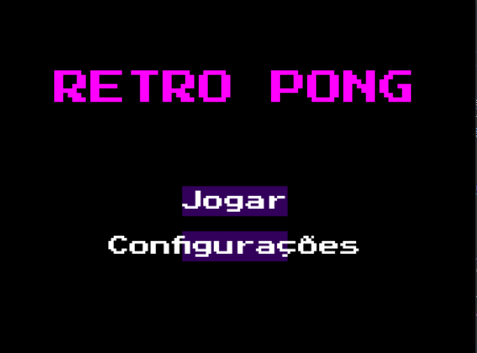
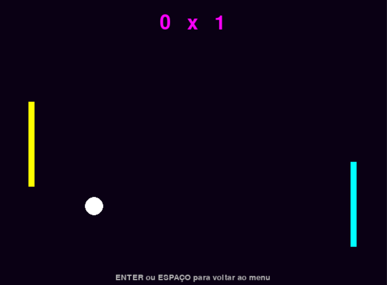

# 🕹️ Retro Pong

Um jogo clássico de Pong com um toque retrô e opções de dificuldade personalizadas. Criado com Python e Pygame, este projeto traz som, animações e um sistema de IA simples e ajustável, com menu inicial, configuração de som e seleção de dificuldade.

---

## 🎮 Funcionalidades

- Interface retrô com animação piscante no menu
- Música de fundo estilo arcade (ativável/desativável)
- Sons de clique e colisão
- IA com dificuldade ajustável
- Sistema de pontuação
- Navegação por teclado e mouse
- Suporte a resolução 640x480

---

## ⚙️ Tecnologias Usadas

- Python 3.x
- Biblioteca [Pygame](https://www.pygame.org/)

---

## 🚀 Como Rodar o Jogo

1. Clone o repositório:
   ```bash
   git clone https://github.com/seu-usuario/pong-em-python.git
   cd pong-em-python
   ```

2. Instale o Pygame:
   ```bash
   pip install pygame
   ```

3. Execute o jogo:
   ```bash
   python ping-pong.py
   ```

---

## 🕹️ Controles

### Menu:
- Clique com o mouse ou use ENTER/ESPAÇO para navegar

### Jogo:
- Seta ↑ = mover paleta para cima
- Seta ↓ = mover paleta para baixo
- ENTER ou ESPAÇO = voltar ao menu

---

## 📸 Capturas de Tela

| Menu Inicial         | Tela de Jogo         |
|----------------------|----------------------|
|     |  |

---

## 📁 Estrutura de Arquivos
```
📁 pong-em-python
├── ping-pong.py
├── README.md
├── musica.ogg
├── ping.wav
├── click.wav
└── arcade.ttf
```